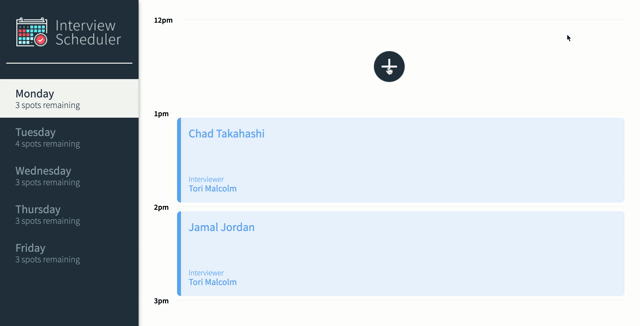
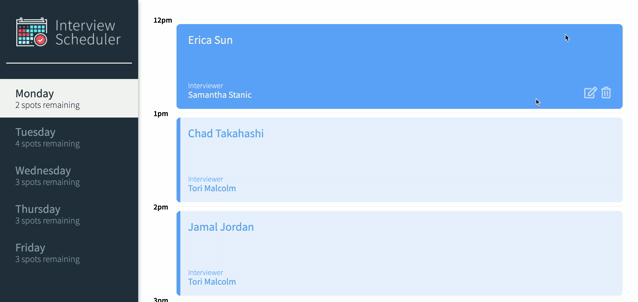

# Interview Scheduler

## Project Description

Inteview Scheduler is a single page web application that, as its name suggests, allows students to book, edit and cancel appointments with interviewers. 

## Final Product

Booking an interview 

Editing an interview

Deleting an interview

## Tech Stack

- React
- Axios
- Webpack
- Babel
- PostgreSQL

## Setup

1. Fork and clone this repository
2. Install all dependencies using `npm install`
3. Start the app server using `npm start`
4. Go to <http://localhost:8000/>
5. Fork and clone the [scheduler-api repository](https://github.com/ericasun2000/scheduler-api)
6. Follow the README.md directions to setup the API server

## Dependencies

- axios
- classnames
- fsevents
- normalize.css
- react
- react-dom
- react-scripts

## Dev Dependencies

- babel/core
- storybook/addon-actions
- storybook/addon-backgrounds
- storybook/addon-links
- storybook/addons
- storybook/react
- testing-library/jest-dom
- testing-library/react
- testing-library/react-hooks
- babel-loader
- node-sass
- prop-types
- react-test-renderer